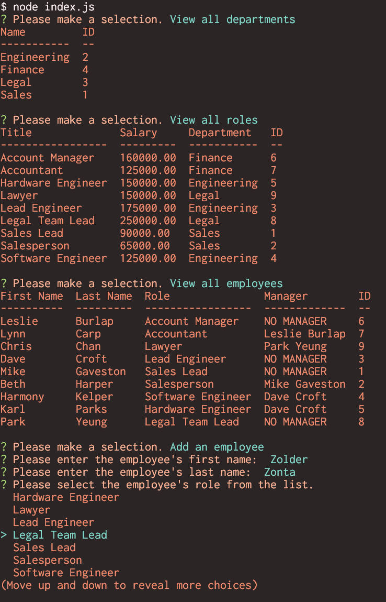

# Employee Tracker

## Description

A commandline interface that allows you to create, store, and display your employees and their relevant roles/departments from within an SQL database.

## Table of Contents
- [Installation](#installation)
- [Usage](#usage)
- [Images](#images)

- [Credits](#credits)

- [License](#license)

## Installation

In order to install the necessary dependencies to run the application, simply navigate to the directory containing index.js (this should be in the root directory of the folder you've cloned from the repository) and run "npm install" in the commandline. Once this has been done, you can load the "db.sql" and "schema.sql" files located within the DB directory using the MySQL commandline in order to create the necessary databases/tables for the program to function. If you'd like to test the application with some dummy data to begin with, you can use the MySQL commandline to load the "seeds.sql" file contained within the db directory as well.

## Usage

The application can be run by typing "node index.js" from within the root directory of rest!

## Images

## Credits

Created by [Daniel Brackenbury](https://github.com/helpvisa).

## License

Copyright 2022 Daniel Brackenbury

Permission is hereby granted, free of charge, to any person obtaining a copy of this software and associated documentation files (the "Software"), to deal in the Software without restriction, including without limitation the rights to use, copy, modify, merge, publish, distribute, sublicense, and/or sell copies of the Software, and to permit persons to whom the Software is furnished to do so, subject to the following conditions:

The above copyright notice and this permission notice shall be included in all copies or substantial portions of the Software.

THE SOFTWARE IS PROVIDED "AS IS", WITHOUT WARRANTY OF ANY KIND, EXPRESS OR IMPLIED, INCLUDING BUT NOT LIMITED TO THE WARRANTIES OF MERCHANTABILITY, FITNESS FOR A PARTICULAR PURPOSE AND NONINFRINGEMENT. IN NO EVENT SHALL THE AUTHORS OR COPYRIGHT HOLDERS BE LIABLE FOR ANY CLAIM, DAMAGES OR OTHER LIABILITY, WHETHER IN AN ACTION OF CONTRACT, TORT OR OTHERWISE, ARISING FROM, OUT OF OR IN CONNECTION WITH THE SOFTWARE OR THE USE OR OTHER DEALINGS IN THE SOFTWARE.
